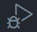
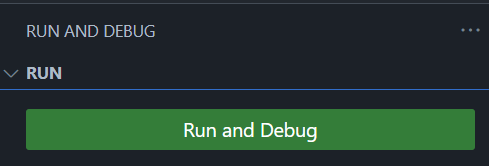
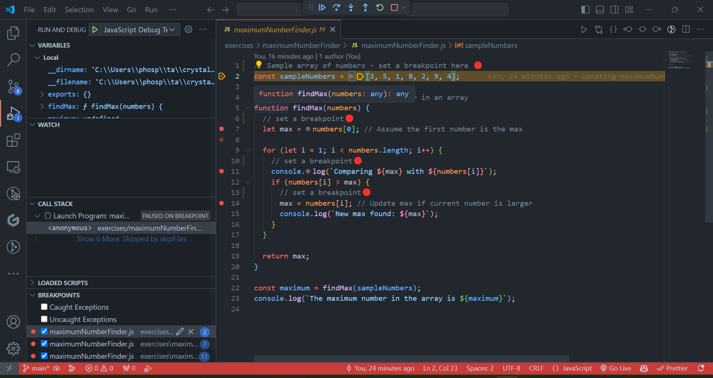

# Debugging Instructions:

## Explaination of Palindromes

A **_palindrome_** is a word, phrase, number, or other sequence of characters that reads the same forward and backward.

> For example, "madam" is a palindrome, while "hello" is not.

---

1. Set Initial Breakpoints 🔴

   - [ ] Start by setting a breakpoint🔴 at the line where `countPalindromes` is called and another inside the `isPalindrome` function.
   - [ ] Open the Run and Debug sidebar by clicking the play icon in the Activity Bar.
         
   - [ ] Select "Run and Debug" (choose Node.js if prompted to select an environment).
         
   - [ ] 

2. Step Over/Into

   - [ ] Use the "Step Over" functionality to go through the code line by line at the top level, and "Step Into" to delve into the nested function calls.
         

3. Track Variables

   - [ ] Observe changes to the `palindromeCount` (a global variable).
   - [ ] Monitor the values of `reverseStr` within the isPalindrome function (local variable).
   - [ ] Keep an eye on the loop variables `i` and `j`, as well as `subStr`.

4. Call Stack and Execution Context

   - [ ] Check the call stack as you step into and out of the `isPalindrome` function to see how the execution context changes.
   - [ ] This will help understand how local variables like `reverseStr` are created and destroyed with each call.

5. Console Output

   - [ ] Use the console output to follow the found palindromes and how the count is incremented.

6. Resume and Checkpoints

   - [ ] Occasionally use "Resume Execution" (Continue) to move to the next breakpoint and see how the program state changes over several iterations.
