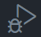
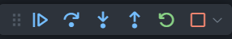

# Debugging Instructions for VS Code

- [ ] Open the File in VS Code: Ensure that the JavaScript file is open in Visual Studio Code.

## Set Breakpoints🔴

- [ ] Place a breakpoint🔴 on the line inside the factorial function where the recursive call is made

  ```javascript
  (let result = n * factorial(n - 1);).
  ```

  > Another useful breakpoint🔴 would be on the base case line (return 1;).

## Start Debugging

- [ ] Go to the Run view by clicking on the play icon in the Activity Bar on the side of the window.
      

- [ ] Select "Run and Debug"
      
  > (if you haven't configured debugging settings, VS Code might prompt you to select an environment; choose Node.js).

## Step Through the Code:

- [ ] Use the "Step Into" feature to follow the code into the recursive calls.
      
- [ ] Observe how the value of n decreases with each call until it reaches the base case.
- [ ] Watch the call stack in the Debug view to see how each function call is added to the stack and then removed as each recursive call completes.

## Examine Variables:

- [ ] Use the Variables pane in the Debug view to monitor the changes to the n and result variables as you step through the code.

## Resume and Continue:

- [ ] After examining each step, you can use the "Continue" button to move to the next breakpoint🔴.
